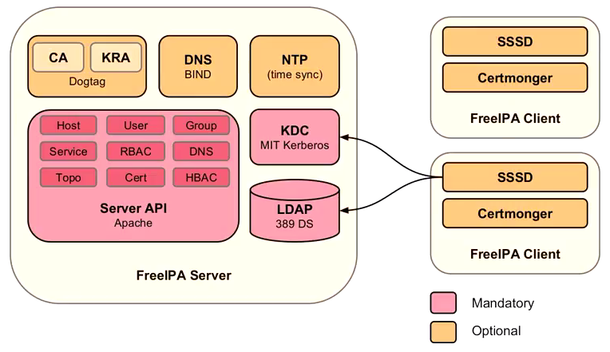

# RMC Network Notes

## Description

### LDAP
LDAP, the Lightweight Directory Access Protocol, is a mature, flexible, and well supported standards-based mechanism for interacting with directory servers. It’s often used for authentication and storing information about users, groups, and applications, but an LDAP directory server is a fairly general-purpose data store and can be used in a wide variety of applications.


### FreeIPA
FreeIPA is an integrated security information management solution combining 389 Directory Server, MIT Kerberos, NTP, DNS, Dogtag certificate system, SSSD and others.
<br>



<br>
- Integrated security information management solution combining Linux (Fedora), 389 Directory Server, MIT Kerberos, NTP, DNS, Dogtag certificate system, SSSD and others.
- Built on top of well known Open Source components and standard protocols
- Strong focus on ease of management and automation of installation and configuration tasks.
- Full multi master replication for higher redundancy and scalability
- Extensible management interfaces (CLI, Web UI, XMLRPC and JSONRPC API) and Python SDK

## Comparison
- Historically Linux environments have a difficult time establishing centralized management
- None of the different protocols communicate well with each other as each has to be managed manually and independently
    - NIS/Kerberos
    - LDAP
    - sudo access
- Goal of FreeIPA is to simplify administrative overhead, all tools in one place
- FreeIPA Functions
    - Create a Linux-based and Linux-controlled domain. Both FreeIPA servers and FreeIPA clients are Linux or Unix machines. While FreeIPA can synchronize data with an Active Directory domain to allow integration with Windows servers, it is not an administrative tools for Windows machines and it does not support Windows clients. FreeIPA is a management tool for Linux domains.
    - Centralize identity management and identity policies.
    - Build on existing, native Linux applications and protocols. While FreeIPA has its own processes and configuration, its underlying technologies are familiar and trusted by Linux administrators and are well established on Linux systems. 
- Can be viewed as an Open Source alternative to Windows AD for linux environments

## Home Lab Setup

Start VMs
```
    vagrant up --provider virtualbox
```

Destroy VMs
```
    vagrant destroy
```

Server Setup
- https://github.com/freeipa/freeipa-workshop/blob/master/1-server-install.rst

Client Setup
- https://github.com/freeipa/freeipa-workshop/blob/master/2-client-install.rst
- be sure to check if dns record added
    - https://www.server-world.info/en/note?os=Fedora_28&p=freeipa&f=3

NFS Config
- https://www.server-world.info/en/note?os=Fedora_28&p=nfs&f=1

AutoFS Setup
- https://blog.delouw.ch/2015/03/14/using-ipa-to-provide-automount-maps-for-nfsv4-home-directories/

## Sources
- [Fedora FreeIPA Guide](https://docs.fedoraproject.org/en-US/Fedora/18/html/FreeIPA_Guide/introduction.html)
- [Reddit - FreeIPA vs. Pure LDAP](https://www.reddit.com/r/linuxadmin/comments/5ye1vt/openldap_freeipa_ad_whats_the_difference/)
- [Identity Management DevOps Conference Presentation](https://www.youtube.com/watch?v=cUQcNi_obIc)
- [FreeIPA Setup Guide](https://www.server-world.info/en/note?os=Fedora_28&p=freeipa&f=3)
- [HomeDir AutoFS](https://www.server-world.info/en/note?os=Fedora_28&p=nfs&f=1)